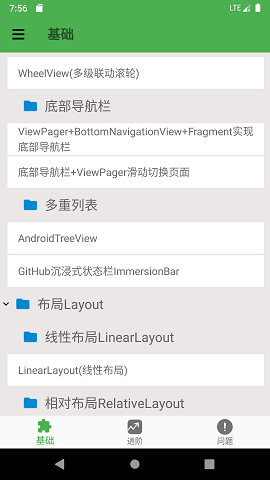
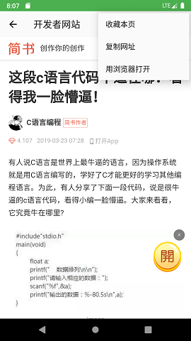

# assistant
市面上关于开发学习类和知识分享类的网站和应用可以说是不胜枚举，似乎再多出一个类似的东西毫无意义。但正是因为这些浩如烟海的“大数据”使得我们找到适合自己的知识变得愈发困难。   
没有几个人是过目不忘的，当我们找到了需要的文章时需要保存起来以备将来之需。但随着时间推移，我们保存的东西越来越多，在浏览器收藏栏上、在CSDN、简书等几个甚至几十个网站的账户上收藏了上百条文章。当我们再次需要某篇文章时可能需要花费大量精力找寻，浪费时间。   
本应用即是可以将全网文章收藏并分类保存的辅助开发类应用。   
   
       
     
  